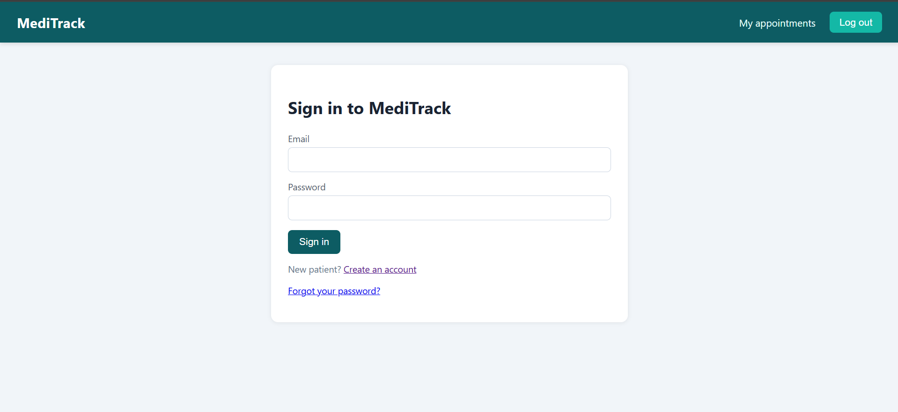
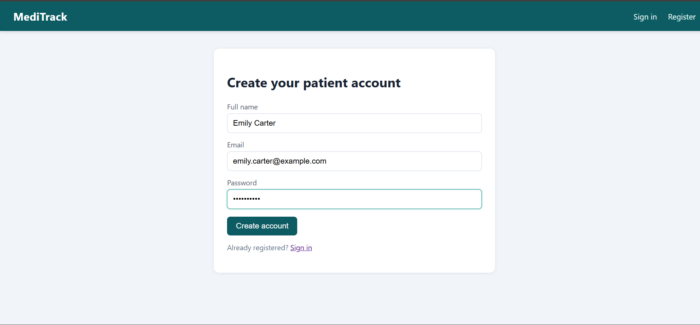
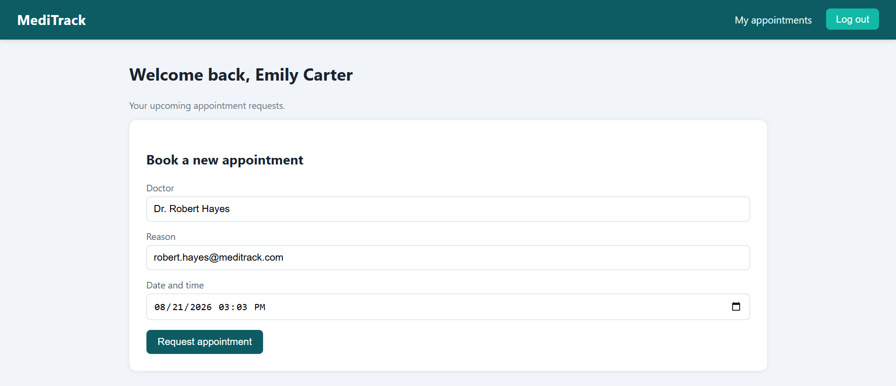
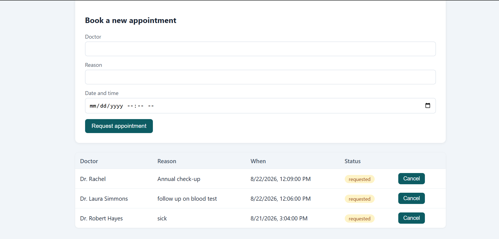
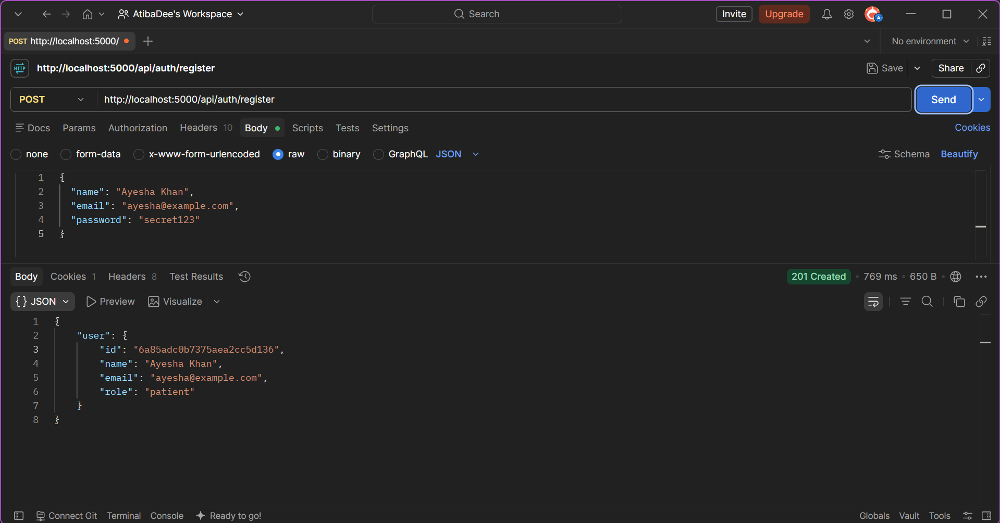
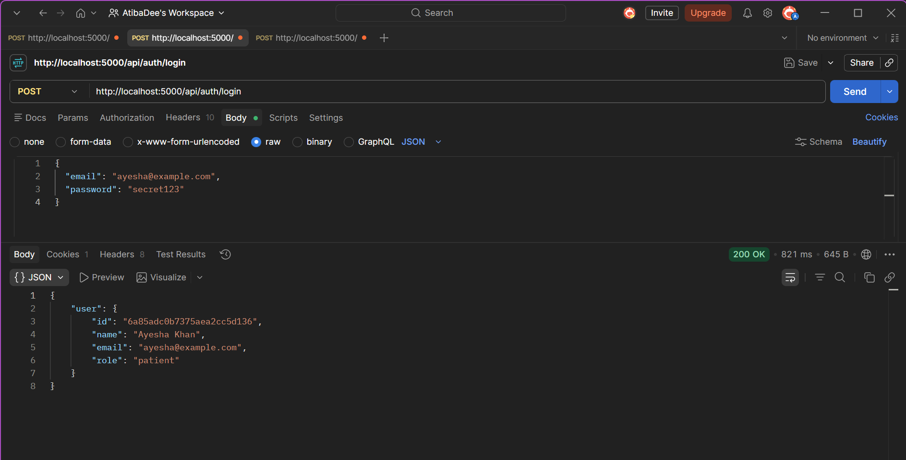
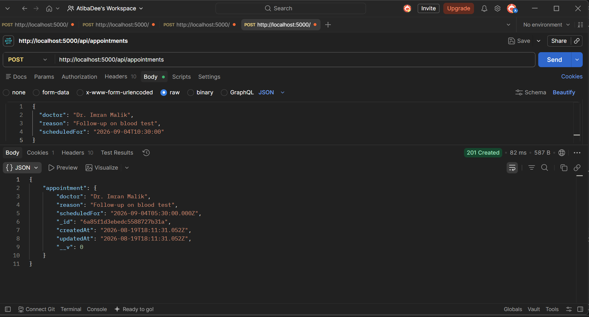
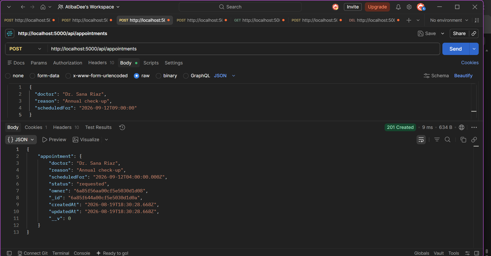
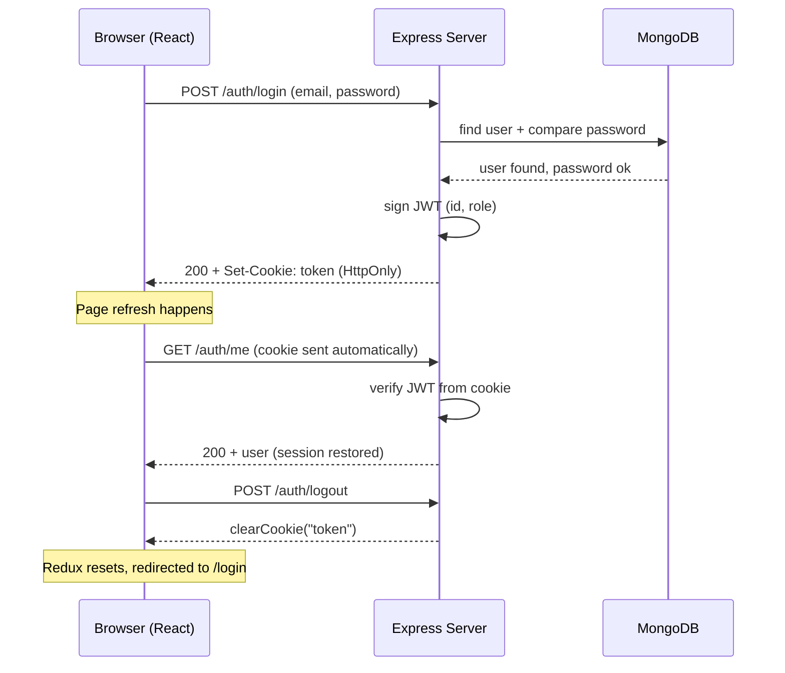
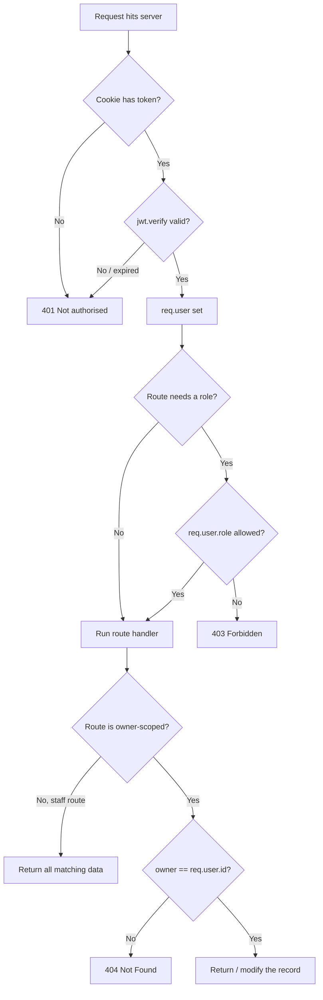

### Full-Stack Healthcare Management System

[](https://react.dev/)
[](https://nodejs.org/)
[](https://expressjs.com/)
[](https://www.mongodb.com/)

</div>

---

## 📖 About

MediTrack is a MERN based healthcare management system for handling **authentication, patients, staff, and appointments** with role-based access control.

## ✨ Features

* 🔐 User Registration & Login
* 👥 Role-Based Access Control
* 📅 Appointment Booking & Tracking
* 🏥 Patient & Staff Management
* 🍪 Cookie/Session Authentication
* 🔒 Protected API Routes
* 📊 User Data Isolation

## 📸 Application Screenshots

<div align="center">

### 1. Overview & Dashboard



---

### 2. Create Account



---

### 3. Patient & Staff Management



---

### 4. Appointment Booking & Tracking



</div>

---

### 🔌 API Testing — Postman

<div align="center">


&nbsp;&nbsp;


<br><br>


&nbsp;&nbsp;


</div>
---

## Request Lifecycle

### Login flow



### Every protected request




## 🛠️ Tech Stack

**Frontend:** React, Axios
**Backend:** Node.js, Express.js
**Database:** MongoDB, Mongoose
**Authentication:** Express Session, Cookies

## 🚀 Run Locally

```bash
git clone https://github.com/Atibayounus/MediTrack.git
cd MediTrack

# Backend
cd server
npm install
npm start

# Frontend
cd ../client
npm install
npm run dev
```

Create a `.env` file in `server` with your MongoDB URI and session secret.

---

## 👨‍💻 Author

**Atiba Younus** — Computer Science Student & Full-Stack Developer

[GitHub](https://github.com/Atibayounus)

---

<div align="center">

⭐ Star the repository if you like it!

</div>
