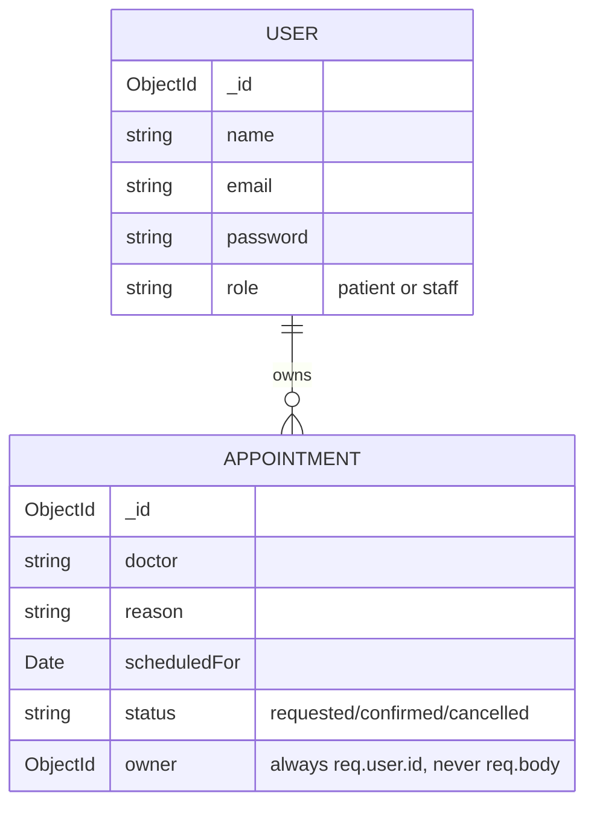

<div align="center">


### Full-Stack Clinic Appointment Portal — Authentication & Role-Based Access

[](https://react.dev/)
[](https://nodejs.org/)
[](https://expressjs.com/)
[](https://www.mongodb.com/)
[](https://redux-toolkit.js.org/)
[](https://jwt.io/)

</div>

## 📖 About

MediTrack is a MERN-based clinic appointment portal built around one core
idea: **a patient logs in with a JWT stored in an HttpOnly cookie, sees only
their own appointments, and staff members (checked server-side by role) can
see and manage every patient's schedule.**

## ✨ Features

* 🔐 Registration & login with hashed passwords (bcrypt)
* 🍪 Session token stored in an **HttpOnly cookie**, never in JavaScript or Redux
* 👥 Role-based access control  `patient` vs `staff`, enforced on the server
* 📅 Appointment booking, cancelling, and status tracking
* 🔒 Ownership scoped queries a patient can never touch another patient's data
* 📊 Session restored on refresh via `GET /api/auth/me`
* 🚫 Patients hitting a staff-only page get redirected to `/forbidden`

## 📸 Application Screenshots

<div align="center">

### 1. Login & Dashboard


### 2. Create Account


### 3. Staff Panel


### 4. Appointment Booking & Tracking


</div>

## 🔌 API Testing — Postman

<table>
  <tr>
    <td></td>
    <td></td>
  </tr>
  <tr>
    <td></td>
    <td></td>
  </tr>
</table>

---

## 📑 Contents
<div align="center">

- [About](#-about)
- [Features](#-features)
- [Screenshots](#-application-screenshots)
- [Setup](#-run-locally)
- [Creating a staff account](#creating-a-staff-account)
- [Route map](#route-map)
- [Data Model](#data-model)
- [Part 9 Extras](#part-9-extras--what-i-did)
- [Reflection](#reflection)
- [Author](#-author)

---

## 🚀 Run Locally

```bash
git clone https://github.com/Atibayounus/MediTrack.git
cd MediTrack

# Backend
cd server
npm install
cp .env.example .env        # Windows: copy .env.example .env
# open .env and fill in MONGO_URI and a long random JWT_SECRET
npm run dev

# Frontend (in a new terminal)
cd ../client
npm install
npm run dev
```

The API runs on `http://localhost:5000` — check `http://localhost:5000/api/health`
The app runs on `http://localhost:5173`

> Restart the backend after every `.env` edit — `JWT_SECRET` is read at boot.

---

## Creating a staff account

Register normally, then in MongoDB Atlas (or Compass) open the `users`
collection and change that document's `role` from `"patient"` to `"staff"`.
Nobody can register themselves as staff — that is deliberate. Log out and
log back in afterward, since the role is baked into the token at login time.

---

## Route map

| Method | Route | Access |
|---|---|---|
| POST | `/api/auth/register` | public |
| POST | `/api/auth/login` | public |
| GET | `/api/auth/me` | logged in |
| POST | `/api/auth/logout` | public |
| GET/POST | `/api/appointments` | logged in, own data only |
| PUT/DELETE | `/api/appointments/:id` | owner only |
| GET | `/api/staff/appointments` | staff only |
| PATCH | `/api/staff/appointments/:id/status` | staff only |

---

## Data Model


<div>

## Part 9 extras — what I did

Everything in Parts 1–8 (register, login, cookie session, ownership filtering,
staff role, protected/role-based routes on both server and client) is complete
and tested.

---

## Reflection

See [REFLECTION.md](./REFLECTION.md) for the six write-up answers.

---

## 👨‍💻 Author

**Atiba Younus** — Computer Science Student & Full-Stack Developer
[GitHub](https://github.com/Atibayounus)

---

<div align="center">

⭐ Star the repository if you like it!

</div>
